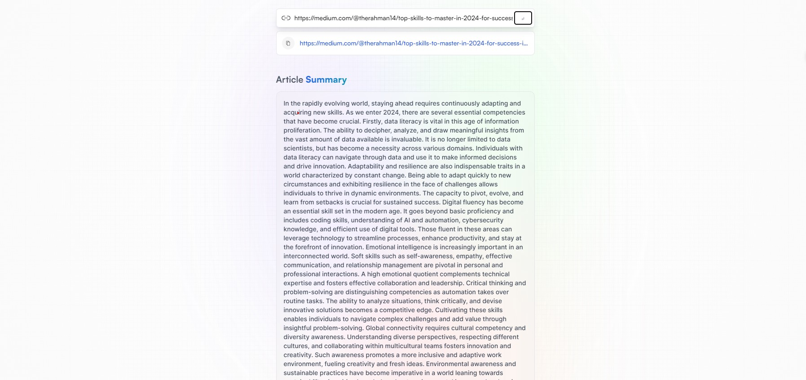
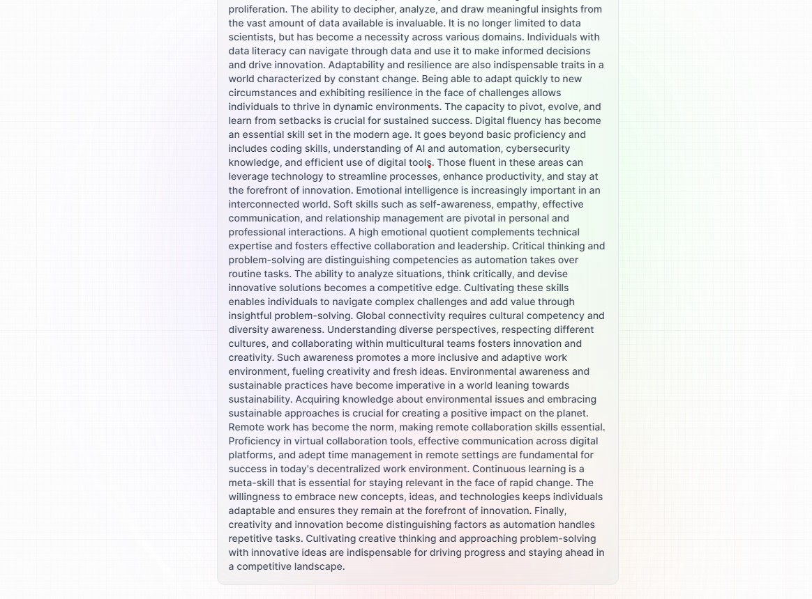

# SummarizeAI

[SummarizeAI](https://summarize-ai-mocha.vercel.app/) is an AI-integrated web application designed to summarize articles effortlessly. By simply entering an article link, the application utilizes advanced AI algorithms to condense the content, providing users with concise and efficient summaries. Powered by RapidApi's Article Extractor and Summarizer, this tool streamlines the process of extracting key information from lengthy articles, making it an ideal solution for users seeking quick insights without delving into full-length content.

## Technologies Used

The technologies and tools were used to develop this project are

- TailwindCSS
- JavaScript
- React
- Redux
- RapidApi ([Article Extractor and Summarizer](https://rapidapi.com/restyler/api/article-extractor-and-summarizer))

## Getting Started

Follow these steps to get the project up and running on your local machine for development and testing:

### Prerequisites

Make sure you have the following requirements met:

- Windows/Linux/Mac machine.

### Installation

1. Clone the repository

   ```bash
   git clone https://github.com/username/projectname.git
   ```

2. Move into the project directory

   ```bash
   cd projectname
   ```

3. Install the dependencies

   ```bash
   npm install
   ```

4. Run the below command to start the web server.

   ```bash
   npm run dev
   ```

   Open link that shows up in the terminal, with your browser to see the result.

### Usage Guide

- Enter your article URL into the input box and click on enter
- SummarizeAI will generate a summary of the article.

## Screenshots






## Contributing

Contributions to SummarizeAI are welcome! To contribute, follow these steps:

1. Fork the repository.
2. Create a new branch for your feature or bug fix:

   ```bash
   git checkout -b feature/your-feature-name
   ```

3. Make changes and commit them:

   ```bash
   git commit -m "Add your commit message here"
   ```

4. Push your changes to your branch:

   ```bash
   git push origin feature/your-feature-name
   ```

5. Create a pull request on the main repository.

Please follow the project's coding guidelines and maintain a clean commit history.

## License

This website is licensed under the MIT License. See the [LICENSE](LICENSE) file for details.

## Contact

If you have any questions or feedback, feel free to reach out to us at <therahman14@gmail.com>. We're excited to hear from you and make this project even better!
